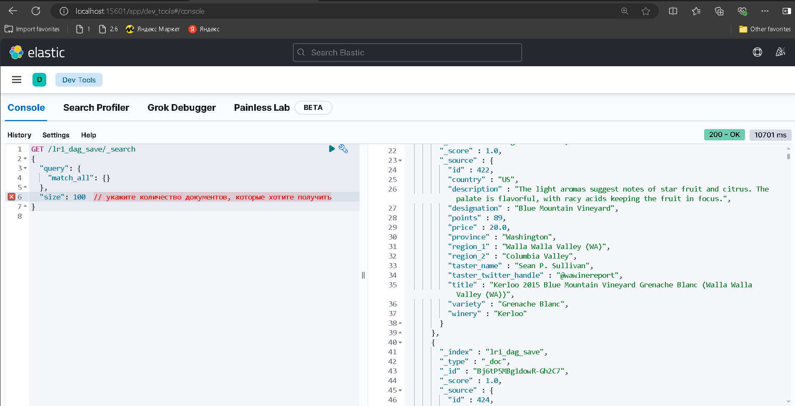
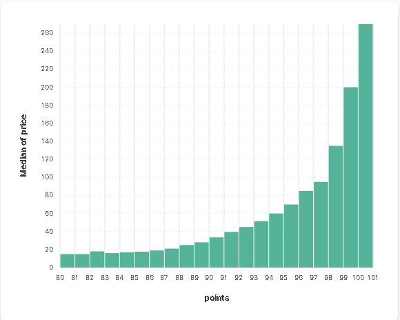
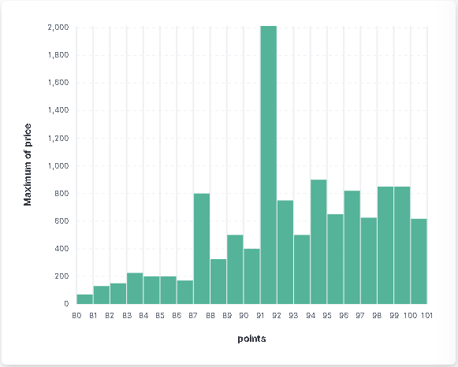
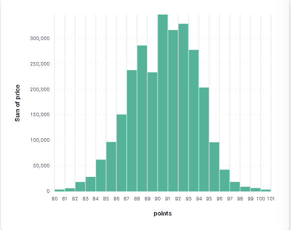

#### Лабораторная работа №1

### Apache Airflow
Есть 5 задач:
read - считывает данные
drop - удаляет строки с designation и region_1 значением null
fill_with_zero - для строк у которых price имеет значение null ставит значение 0
save_elastic_search - сохраняет итоговую таблицу в ElasticSearch
save_csv - сохраняет итоговую таблицу локально

Сначала возникали проблемы с записью данных в ElasticSearch.
Потом возникла проблема, что страница по адресу, по которому записывал данные была недоступна, потом сделал действия, как показано ниже, и убедился, что данные записаны.

### Apache NiFi

GetFile - считывает данные
UpdateAttribute - получает из всего считанного один файл
SplitRecord - разделяет построчно
QueryRecord - фильтрация
	SELECT * FROM FLOWFILE WHERE designation IS NOT NULL AND region_1 IS NOT NULL;
UpdateRecord - для price меняет null на 0.0 
MergeRecord - объединяет строки (помогла одногруппница, тк комп вообще не вывозил очереди, которые появлялись без объединения)
PutElasticsearchHttpRecord - сохраняет записи в elastic search
PutFile - сохраняет файл в директорию

### Kibana 

Графики, построенные средствами Kibana

