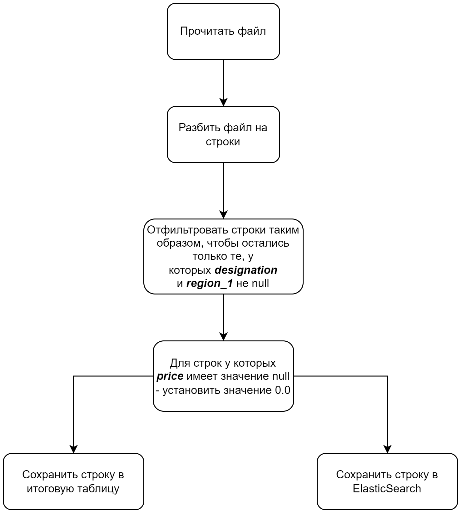

# Лабораторная работа №1

## Базовый пайплайн работы с данными

В рамках данной лабораторной работы предлагается построить простейший пайплайн, собирающий воедино данные из нескольких файлов, обрабатывающий их и сохраняющий результат в no-sql базу данных.

Для построения такого пайплайна воспользуемся следующими инструментами:

* Apache Airflow
* Apache NiFi
* ElasticSearch
* Kibana

В качествен данных - будем использовать набор из нескольких CSV файлов, полученных из набора данных [wine-review](https://www.kaggle.com/datasets/zynicide/wine-reviews/)

CSV файлы с данными можно найти в папке `data` данного репозитория.

## Подготовка к выполнению задания

Для выполнения лабораторной работы рекоммендуется воспользоваться докер контейнерами из подготовительного репозитория: <https://github.com/ssau-data-engineering/Prerequisites/tree/main>

## Задание на лабораторную работу

Схема описывающая пайплайн, который необходимо построить в рамках лабораторной работы:



Данный пайплайн должен быть построен ***дважды***: один раз с использованием **Apache Nifi** и второй раз с использованием **Apache Airflow**.

Также средствами `Kibana` построить гистограмму стоимости напитка к баллам поставленными дегустаторами.

**Под сохранением в итоговую таблицу подразумевается объединение всех строк прощедших через пайплайн в единую .csv таблицу**

## Сдача лабораторной работы

Для успешной сдачи лабораторной работы итоговый репозиторий должен содержать следующее:

1. Отчет описывающий этапы выполнения работы (скриншоты, описание встреченных проблем и их решения приветствуются) 
в формате .pdf или .md
2. Для **Apache Nifi** в репозитории должен быть приложен `.xml` файл, содержащий разработанный пайплайн. (для генерации такого файла, необходимо создать template и экспортировать его через меню `Templates` расположенное в выпадающем списке в правом верхнем углу)
3. Для **Apache Airflow** должны быть приложен программный код реализующий DAG
4. Открыт Pull Request в настоящий репозиторий

## FAQ

### FAQ General

1. Все контейнеры, если выпользуетесь репозиторием `Prerequisites`, объединены в единую сеть.
   * Например, для обращения к `elsaticseach` из **DAG** необходимо использовать не адресс ~~http://localhost:19200~~,
     а `http://elasticsearch-kibana:9200`.
     Подробнее о DNS и сетевой состовляющей docker можете узнать по следующей ссылке: <https://docs.docker.com/compose/networking/>

### FAQ Apache Nifi

1. CSV файлы необходимо перенести в папку, к оторой **NiFi** имеет доступ (например в папку `nifi/data/lab_1/input`), или можно модифицировать `docker-compose` для проброса папки.
2. Для реализации пайплайна достаточно следующих процессоров:
    * GetFile
    * SplitRecord
    * [QueryRecord](http://localhost:18080/nifi-docs/documentation?select=org.apache.nifi.processors.standard.QueryRecord&group=org.apache.nifi&artifact=nifi-standard-nar&version=1.23.2)
    * [UpdateRecord](http://localhost:18080/nifi-docs/documentation?select=org.apache.nifi.processors.standard.UpdateRecord&group=org.apache.nifi&artifact=nifi-standard-nar&version=1.23.2)
    * MergeContent
    * PutFile
    * PutElasticsearchHttp
3. Регулярное выражение для выбора csv файлов из папки: `[^\.].*\.csv`
4. Свойства `Include Zero Record FlowFiles` у процессоров `QueryRecord` рекомендуется устанавливать в значение `false`.
5. `http://elasticsearch-kibana:9200` - адрес ElasticSearch
6. Для объединения очередей можно использовать `Funnel`


### FAQ Apache Airflow

1. Для работы с CSV данными рекомендуется использовать библиотеку `pandas`
2. Для того чтобы добавить новый **DAG** в `Airflow`, поместите `.py` файл в директорию `Prerequisites\airflow\dags`
3. Для видимости данных внутри пайплайна поместите файлы в директорию `Prerequisites\airflow\data`
4. Вы всегда можете проверить как проброшены директории и порты посмотрев на соответствующие `docker-compose` конфигурации
5. Если вы не можете обнаружить ваш **DAG** в интерфейсе `Airflow` - это означает наличие ошибок в файле пайплайна.
    Чтобы увидеть список ошибок - подключитесь к терминалу контейнера `airflow-worker` и выполните следующую комманду:

    ```bash
    airflow dags list-import-errors
    ```

    [Как выполнить команду внутри Docker контейнера?](https://www.mousedc.ru/learning/565-komanda-docker-konteyner/)

    Также вы можете подключиться к терминалу докер контейнера средствами vscode.
